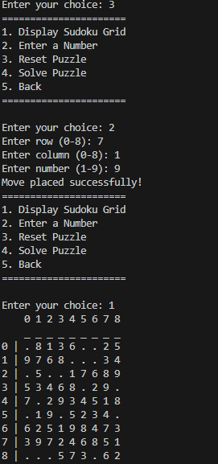

# Sudoku Game

## Overview

A Sudoku Game programmed in Java which runs in the command line.

## Features

- Generate a sudoku puzzle at a custom difficulty.
- Solve the puzzle using backtracking.
- Play the game allowing you to make moves and reset the puzzle.

    
    
    

